# BlackRed USSD Flow Inventory (Ghana) — Source for the Nigeria Channel-Adapter Rewrite

**Source directory:** `BlackRed/EngineAndServices/ussd`
**Source of truth for state list:** `ussd/lib/states.php` → `USSD_STATE_FILES` (23 states)
**Dispatcher:** `ussd/index.php` (Nalo webhook handler)
**Extraction date:** 2026-08 · read-only extraction, no source files modified.

This document is a verbatim inventory of the 23-state USSD finite state machine, for the
purpose of carrying its flow structure and screen copy forward into a Nigeria channel
adapter after the Ghana money logic (ANM MoMo, Hubtel SMS, GHS pesewas math) is deleted.

Screen text is quoted **exactly** as it appears in the PHP source (including line breaks,
punctuation, and capitalization). Character counts are computed on the literal string
`render_*()`/`handle_*()` functions return (i.e. what `respStay()`/`respEnd()`/`respNext()`
wrap), counting `\n` as one character each — this is what a `strlen()`-based 160-char CI
check would see.

---

## 1. How responses work (needed to read the tables below)

Every state file exports `render_<NAME>($session)` and `handle_<NAME>($input, $session)`,
both taking `$session` by reference. Both return one of three shapes (`ussd/lib/response.php`):

| Helper | Meaning | Nalo `MSGTYPE` |
|---|---|---|
| `respStay($msg)` | Re-render the **current** state (validation error, retry) | `true` (CON) |
| `respNext($state)` | Transition to a new state; `index.php` immediately calls that state's `render()` in the same turn | `true` (CON) |
| `respEnd($msg)` | Terminal screen, session over | `false` (END) |
| `respEndWithTask($msg, $task, $args)` | Terminal screen + a task (ANM MoMo call) queued to run *after* the HTTP response is sent and the USSD session is closed on-handset | `false` (END) |

`ENTRY` is special: it never shows the user anything itself. It looks up the player and
immediately returns `respNext(...)` or `respEnd(...)`, so the *first* screen a user ever sees
is whatever `MAIN_MENU` or `UNREGISTERED_MENU` renders.

---

## 2. Master table — all 23 states

| # | State | File | Screens (render variants) | Max chars found | >160? | Money/eligibility side effect |
|---|---|---|---|---:|:---:|---|
| 1 | `ENTRY` | EntryState.php | 0 (routes only) + 4 END texts | 53 | No | Player lookup, lockout check |
| 2 | `UNREGISTERED_MENU` | UnregisteredMenuState.php | 3 | 60 | No | ANM name-lookup call (registration start) |
| 3 | `MAIN_MENU` | MainMenuState.php | 2 | 112 | No | none |
| 4 | `BALANCE` | BalanceState.php | 4 | 93 | No | Balance read |
| 5 | `LAST_STAKE` | LastStakeState.php | 4 | 112 | No | none (read-only) |
| 6 | `REG_PICK_PROVIDER` | RegPickProviderState.php | 2 | 58 | No | ANM name-lookup call |
| 7 | `REG_CONFIRM_NAME` | RegConfirmNameState.php | 3 | 80* | No | none (confirms identity) |
| 8 | `REG_SET_PASSWORD` | RegSetPasswordState.php | 2 | 68 | No | Hashes PIN (Argon2id), stashed in session |
| 9 | `REG_CONFIRM_PASSWORD` | RegConfirmPasswordState.php | 6 | 63 | No | **Creates player row**, sends welcome SMS |
| 10 | `DEP_ENTER_AMOUNT` | DepEnterAmountState.php | 4 | 77 | No | none |
| 11 | `DEP_CONFIRM` | DepConfirmState.php | 4 | 107 | No | **Inserts deposit row**, queues ANM MoMo prompt |
| 12 | `WD_PICK_DESTINATION` | WdPickDestinationState.php | 2 | 39 | No | none |
| 13 | `WD_PLAY_ENTER_AMOUNT` | WdPlayEnterAmountState.php | 5 | 100 | No | Soft balance check |
| 14 | `WD_PLAY_CONFIRM` | WdPlayConfirmState.php | 3 | 62 | No | none |
| 15 | `WD_PLAY_PASSWORD` | WdPlayPasswordState.php | **BROKEN — see §7 bug** | — | — | Intended: Payout→Play transfer |
| 16 | `WD_MOMO_ENTER_AMOUNT` | WdMomoEnterAmountState.php | 5 | 97 | No | Soft balance check |
| 17 | `WD_MOMO_CONFIRM` | WdMomoConfirmState.php | 3 | 62 | No | none |
| 18 | `WD_MOMO_PASSWORD` | WdMomoPasswordState.php | 5 | 95 | No | **Inserts withdrawal row**, queues ANM MTC payout |
| 19 | `PLAY_PICK_TYPE` | PlayPickTypeState.php | 2 | 104 | No | none |
| 20 | `PLAY_PICK_COLORS` | PlayPickColorsState.php | 3 | 77 | No | none |
| 21 | `PLAY_ENTER_STAKE` | PlayEnterStakeState.php | 4 | 94 | No | Soft balance check |
| 22 | `PLAY_CONFIRM` | PlayConfirmState.php | 4 | 112 | No | **Debits stake, resolves round, credits payout** (synchronous, no ANM) |
| 23 | `PLAY_AGAIN` | PlayAgainState.php | 3 | 40 | No | none |

\* Assumes a realistic ANM-returned MoMo registration name. See §5 for why this is the one
field genuinely at risk of tipping over budget.

**Headline finding: nothing currently exceeds 160 characters**, even in worst-case
substitutions (max stake, max balance, 5-card game, loss outcome). The largest screen found
is 112 characters (`MAIN_MENU` render, `LAST_STAKE` worst case, `PLAY_CONFIRM` win result).
See §6 for the full ranked list and the one real risk for Nigeria (Naira digit count).

---

## 3. Per-state detail

For each state: exact screen text(s), valid inputs, transitions, invalid-input behavior,
side effects.

### 1. `ENTRY` — EntryState.php

No screen of its own — runs on every dial, looks up the player by MSISDN, and immediately
routes. `handle_ENTRY` is a defensive no-op (should never execute).

| Player state | Result |
|---|---|
| Not found | → `UNREGISTERED_MENU` |
| `accountStatus = frozen` | END: `"Your account is frozen.\nPlease contact support."` (47 chars) |
| `accountStatus = closed` | END: `"Your account is closed.\nPlease contact support."` (47 chars) |
| Locked out (3 wrong PINs, shared with web) | END: `"Too many wrong PIN attempts.\nTry again in {N} minute(s)."` (53 chars @ N=15) |
| Registered + active | Attaches `playerId` + `firstName` to session → `MAIN_MENU` |
| (`handle_ENTRY` reached at all — should never happen) | END: `"Something went wrong. Please dial *920*9# again."` (48 chars) |

**Side effect:** `playerByMsisdn()` lookup, `playerLockoutCheck()`.

---

### 2. `UNREGISTERED_MENU` — UnregisteredMenuState.php

```
Hello 0244000001
Welcome to BlackRed
---
1. Register
2. Exit
```
60 chars (with a 10-digit local display MSISDN).

**Inputs:**
| Input | Action |
|---|---|
| `1` | Resolve provider from Nalo's `NETWORK` field → ANM name lookup. Success → `REG_CONFIRM_NAME`. Unknown network → `REG_PICK_PROVIDER`. ANM failure → END with ANM's error message + `"\nPlease try again later."` |
| `2` | END: `"Goodbye."` (8 chars) |
| anything else | `respStay`: `"Invalid choice. Try again:\n1. Register\n2. Exit"` (46 chars) |

**Side effect:** ANM name-lookup API call (registration start).

---

### 3. `MAIN_MENU` — MainMenuState.php

```
Hello FirstName
Welcome to BlackRed
----
1. Play Now
2. Deposit
3. Withdraw
4. Check Balance
5. Check Last Stake
```
112 chars.

**Inputs:** `1`→`PLAY_PICK_TYPE`, `2`→`DEP_ENTER_AMOUNT`, `3`→`WD_PICK_DESTINATION`,
`4`→`BALANCE`, `5`→`LAST_STAKE`. Anything else: `respStay` with `"Invalid choice. Try
again:\n"` + the same 5-item list (98 chars).

**Side effect:** none. Falls back to greeting "there" if `firstName` missing from session.

---

### 4. `BALANCE` — BalanceState.php

Terminal state — `handle_BALANCE` always ENDs regardless of input.

```
Hello FirstName
Your Balances Are:
----
Play Balance: GHS 5000.00
Payout Balance: GHS 5000.00
```
93 chars at max balances.

Error paths: `"Session error. Please dial *920*9# again."` (41), or if `playerBalances()`
throws: `"Balance Temporarily Unavailable.\nPlease Try Again Later."` (56). `handle_BALANCE`
(any input) → `"Goodbye."`.

**Side effect:** balance read only.

---

### 5. `LAST_STAKE` — LastStakeState.php

Terminal state. Formats the most recent game round.

```
Your Last Stake Is A Loss
--
You Staked GHS 2000.00 For 5 Cards(x100)
--
Your Selection: BRBRB
The Result: RBRBR
```
112 chars at the theoretical worst case (5-card, max stake, loss). Never-played case:
`"You have not played yet.\nDial *920*9# anytime to play."` (54). Error case: `"Last stake
temporarily unavailable.\nPlease try again."` (53).

**Note on the source comment:** the file's own header comment computes its worst-case at "GHS
2,000.00" with a thousands separator and claims a 146-char USSD limit — but `formatPesewas()`
(`lib/player.php`) does **not** insert thousands separators (`sprintf('GHS %s%d.%02d', ...)`),
so the real worst case is shorter than the comment states (112, not 122). Don't carry the
comment's arithmetic forward; carry the actual `formatPesewas` behavior.

**Side effect:** none (read-only).

---

### 6. `REG_PICK_PROVIDER` — RegPickProviderState.php

Fallback only — reached when Nalo's `NETWORK` field is empty or unrecognized.

```
Pick Your MoMo Network:
--
1. MTN
2. Telecel
3. AirtelTigo
```
58 chars.

**Inputs:** `1`→MTN, `2`→Telecel(VOD), `3`→AirtelTigo(AIR), each triggers an ANM lookup →
`REG_CONFIRM_NAME` on success, END with ANM's error on failure. Invalid: `respStay` with
`"Invalid choice. Try again:\n"` + same list (58 chars).

**Side effect:** ANM name-lookup API call.

---

### 7. `REG_CONFIRM_NAME` — RegConfirmNameState.php

**The one screen most worth preserving verbatim.** Shows the name ANM's MoMo lookup returned
for the caller's own SIM — the player never types their name.

```
Your MoMo Name:
KOFI MENSAH
--
1. Yes, continue
2. No, cancel
```
61 chars for a short name; ~80 chars for a longer compound Ghanaian name
(e.g. "AKOSUA FRIMPONG MENSAH-BOATENG").

**Inputs:** `1`→`REG_SET_PASSWORD`. `2`→END: `"Registration cancelled.\nThank you."` (34).
Invalid: `respStay`: `"Invalid choice.\n1. Yes, continue\n2. No, cancel"` (46).

**Side effect:** none — pure routing on data already fetched by the previous state.

---

### 8. `REG_SET_PASSWORD` — RegSetPasswordState.php

```
Set Your PIN
--
Enter a 4-digit
PIN for your
account.
Type and send:
```
68 chars.

**Policy (from `lib/password.php`):** exactly 4 digits, no forbidden-PIN list.

**Inputs:** valid 4-digit PIN → hashed immediately with Argon2id (never stored as plaintext,
even transiently in the session JSON column) → `REG_CONFIRM_PASSWORD`. Invalid → `respStay`
with the specific policy violation (`"PIN must be exactly 4 digits."` or `"PIN must be 4
digits, no letters."`) + `"\n--\nType and send again:"` (57 chars worst case). Hash failure
(rare) → END `"Registration failed. Please try again later."`.

**Side effect:** `hashPassword()` — CPU-bound Argon2id hash, no I/O.

---

### 9. `REG_CONFIRM_PASSWORD` — RegConfirmPasswordState.php

```
Confirm Your PIN
--
Type the same
PIN again
and send:
```
53 chars.

**Design decision:** mismatch is a **one-shot END, not a retry loop** — the file's own
comment explains why: bouncing the user back to re-type a PIN twice already is worse UX than
telling them plainly and letting them redial. `"PINs did not match.\nPlease dial *920*9# to
try again."` (53).

**On match:** creates the player row, sends a welcome SMS (best-effort, swallows failures),
clears all staged registration data from the session, and ENDs:
```
Welcome Akosua!
--
Registration complete.
Dial *920*9# to play.
```
63 chars. Other END paths: session error (missing staged data, 41-43 chars), unique-constraint
race lost (`"You are already registered.\nDial *920*9# to play."`, 49), DB/unexpected error
(`"Registration failed. Please try again later."`, 44).

**Side effect:** **creates the player account** (`playerCreate`), sends welcome SMS via Hubtel.

---

### 10. `DEP_ENTER_AMOUNT` — DepEnterAmountState.php

```
Enter Deposit Amount
--
Min: GHS 2.00
Max: GHS 5000.00
--
Type amount in GHS:
```
77 chars.

**Input parsing** (reused verbatim-in-spirit by every other amount/stake state): accepts
`20`, `20.5`, `20.50`, `.5` via regex `^\d+(\.\d{1,2})?$|^\.\d{1,2}$`, converted to integer
minor units by string-splitting on `.` (no float math, no rounding drift).

**Inputs:** in-range amount → stash, `DEP_CONFIRM`. Unparseable → `"Invalid amount.\n--\nEnter
a number\nlike 20 or 20.50:"` (51). Below min → `"Too low. Min GHS 2.00\n--\nType amount in
GHS:"` (44). Above max → `"Too high. Max GHS 5000.00\n--\nType amount in GHS:"` (48).

**Side effect:** none.

---

### 11. `DEP_CONFIRM` — DepConfirmState.php

```
Deposit GHS 5000.00
From: 0244000001 (MTN)
Current Bal: GHS 5000.00
--
1. Confirm
2. Cancel
```
107 chars at max deposit / max balance.

**Inputs:** `2`→END `"Deposit cancelled."` (18). `1`→ runs `depositPreflight()` synchronously
(validates + inserts a `depositRequest` row), then **ends the USSD session immediately** and
queues a post-response task (`deposit_anm_call`) that sleeps 3 seconds and fires the ANM MoMo
PIN-prompt call **after** the handset session has closed:
```
MoMo prompt is on the way.
--
Approve to deposit
GHS 5000.00
to Your BlackRed Account.
You will get an SMS.
```
107 chars. Preflight failures (ineligible account, pending deposit, amount range) → END with
the specific reason. Invalid choice → `respStay`: `"Invalid choice.\n1. Confirm\n2. Cancel"` (36).

**Side effect:** **inserts deposit request row**; queues an async ANM/MoMo API call that
happens after the HTTP response is sent (see §8, design decision #3).

---

### 12. `WD_PICK_DESTINATION` — WdPickDestinationState.php

```
Withdraw to:
--
1. Play Balance
2. MoMo
```
39 chars.

**Inputs:** `1`→`WD_PLAY_ENTER_AMOUNT`, `2`→`WD_MOMO_ENTER_AMOUNT`. Invalid: `respStay`:
`"Invalid choice.\n1. Play Balance\n2. MoMo"` (39).

**Side effect:** none.

---

### 13. `WD_PLAY_ENTER_AMOUNT` — WdPlayEnterAmountState.php

```
Move Payout to Play
--
Payout Bal: GHS 5000.00
Min: GHS 1.00
Max: GHS 5000.00
--
Type amount in GHS:
```
100 chars.

**Inputs:** valid + within Payout balance → `WD_PLAY_CONFIRM`. Same amount-parsing rules as
deposit. Soft balance pre-check (friendlier than failing after the password step): `"Not
enough in Payout.\nYou have GHS 5000.00\n--\nType amount in GHS:"` (65).

**Side effect:** none (soft balance read; hard check happens under DB lock at transfer time).

---

### 14. `WD_PLAY_CONFIRM` — WdPlayConfirmState.php

```
Move GHS 5000.00 To Your Play Balance
---
1. Confirm
2. Cancel
```
62 chars.

> Note: the file's own header comment describes a richer "Payout 50→30 / Play 12→32"
> before/after preview screen. The actual `render_WD_PLAY_CONFIRM()` code does **not**
> implement that — it shows only the flat amount line above. Comment is aspirational/stale;
> the code is the source of truth used in this inventory.

**Inputs:** `2`→END `"Transfer cancelled."` (19). `1`→ resets the password-retry counter,
`WD_PLAY_PASSWORD`. Invalid: `respStay`: `"Invalid choice.\n1. Confirm\n2. Cancel"` (36).

**Side effect:** none at this step.

---

### 15. `WD_PLAY_PASSWORD` — WdPlayPasswordState.php — **BROKEN, see §7**

`states.php` requires this file expecting it to define `render_WD_PLAY_PASSWORD` /
`handle_WD_PLAY_PASSWORD`. It does not — see the bug writeup in §7. **Every "Move Payout to
Play" withdrawal currently crashes at this step** and falls into `index.php`'s generic
`DISPATCH_ERROR` handler (`"Service temporarily unavailable. Please try again shortly."` in
production, or the raw exception in dev). Intended behavior (inferred from the byte-identical
`WdMomoPasswordState.php` it was copy-pasted from, and from `WD_PLAY_CONFIRM`'s comment that
it resets `wdPwAttempts`): PIN entry, 3-attempt shared lockout, on success perform the
Payout→Play internal transfer and END.

**Side effect (intended, not currently reachable):** internal wallet transfer, no ANM call
needed (no money leaves the platform).

---

### 16. `WD_MOMO_ENTER_AMOUNT` — WdMomoEnterAmountState.php

```
Withdraw to MoMo
--
Payout Bal: GHS 5000.00
Min: GHS 1.00
Max: GHS 5000.00
--
Type amount in GHS:
```
97 chars. Same parsing/validation/soft-balance-check shape as `WD_PLAY_ENTER_AMOUNT`.

**Side effect:** none.

---

### 17. `WD_MOMO_CONFIRM` — WdMomoConfirmState.php

```
Send GHS 5000.00
To: 0244000001 (MTN)
---
1. Confirm
2. Cancel
```
62 chars. Shows the destination MoMo number explicitly — always the player's own **registered**
number; there is no "send to a different number" option (a deliberate anti-fraud constraint
noted in the file comment as "Q3 answer").

**Inputs:** `1`→ resets pw-attempt counter, `WD_MOMO_PASSWORD`. `2`→END `"Withdrawal
cancelled."` (21, inferred from symmetry — actual string is `"Withdrawal cancelled."`).
Invalid: `respStay`: `"Invalid choice.\n1. Confirm\n2. Cancel"` (36).

**Side effect:** none at this step.

---

### 18. `WD_MOMO_PASSWORD` — WdMomoPasswordState.php

```
Enter your PIN
to confirm:
```
26 chars.

**Auth flow:** checks the shared lockout pool *before* verifying (so a lock tripped from the
web channel mid-USSD-session is honored). Wrong PIN → `playerLockoutBump()`, then either:
- lock just tripped (3rd miss): END `"Too many wrong PIN attempts.\nAccount locked for 15
  min.\nWithdrawal cancelled."` (77)
- attempts remain: `respStay`: `"Wrong PIN.\n{N} attempt(s) left.\nTry again:"` (≤38)

Correct PIN → resets lockout counter, runs `withdrawalToMomoPreflight()` (validates +
inserts a `withdrawalRequest` row), ENDs immediately, and queues `withdrawal_anm_call` (same
close-then-fire pattern as deposit, 3s delay):
```
Withdrawal is on the way.
--
GHS 5000.00 will be sent
to your MoMo wallet.
You will get an SMS.
```
95 chars.

**Side effect:** **inserts withdrawal request row**; queues async ANM MTC disbursement call.

---

### 19. `PLAY_PICK_TYPE` — PlayPickTypeState.php

```
Choose Your Game:
--
1. 1 Card(x2)
2. 2 Cards(x10)
3. 3 Cards(x20)
4. 4 Cards(x50)
5. 5 Cards(x100)
```
99 chars. Compact `"N Cards(xM)"` copy style (no space before parens) is used consistently
everywhere a game type is displayed (this screen, `PLAY_PICK_COLORS`, `LAST_STAKE`).

**Inputs:** `1`-`5` → `PLAY_PICK_COLORS`. Invalid: `respStay`: `"Invalid choice. Pick
1-5:\n"` + same list (104 chars — the single longest *invalid-input* screen in the app).

**Side effect:** none.

---

### 20. `PLAY_PICK_COLORS` — PlayPickColorsState.php

```
Enter your Selection
For 5 Cards
-----------
B = Black
R = Red
Example: BBBBB
```
77 chars at the 5-card worst case.

**Input parsing:** case-insensitive, whitespace-stripped (`"B R B"` → `"BRB"`), length must
exactly match the chosen game type, each char must be `B`/`R`.

**Invalid:** wrong length → `"Enter exactly N letter(s).\nB = Black, R = Red\nExample:
{RRRR}\nTry again:"` (69 at N=5). Bad character → `"Only B or R allowed.\nB = Black, R =
Red\nExample: {BBBB}\nTry again:"` (65).

**Side effect:** none.

---

### 21. `PLAY_ENTER_STAKE` — PlayEnterStakeState.php

```
Enter Your Stake
--
Play Bal: GHS 5000.00
Min: GHS 2.00
Max: GHS 2000.00
--
Type stake in GHS:
```
94 chars. Same amount-parser as deposit/withdrawal; soft balance pre-check against Play
balance: `"Not enough in Play.\nYou have GHS 5000.00\n--\nType stake in GHS:"` (62).

**Side effect:** none.

---

### 22. `PLAY_CONFIRM` — PlayConfirmState.php

```
5 Cards (x100)
Picks: R B R B R
Stake: GHS 2000.00
Win: GHS 200000.00
--
1. Play
2. Cancel
```
90 chars at the 5-card max-stake worst case. Precomputes and shows the potential payout
*before* the player commits — the only screen in the app that previews an outcome.

**Inputs:** `2`→ clears round data, END `"Cancelled. Thank you."` (21). `1`→ runs `gamePlay()`
**synchronously** (debit stake, resolve draw, credit payout — no ANM, no async step, unlike
deposit/withdrawal), clears round data, and routes (`respNext`) to `PLAY_AGAIN` carrying the
result text in `session.data.playResultMsg`:

Win:
```
You WON GHS 200000.00!
Drawn: R B R B R
New Play: GHS 5000.00
New Payout: GHS 200000.00
--
1. Play Again
2. Exit
```
112 chars (the longest screen in the whole app, tied with `MAIN_MENU`/`LAST_STAKE` worst case).

Loss:
```
No win this time.
Drawn: R B R B R
Your Picks: R B R B R
New Play: GHS 5000.00
--
1. Play Again
2. Exit
```
103 chars.

**Side effect:** **debits the stake, resolves the round, credits any payout** — the entire
money-moving action for a play, executed in one synchronous call.

---

### 23. `PLAY_AGAIN` — PlayAgainState.php

Pure post-round menu. Renders whatever result text `PLAY_CONFIRM` stashed — the round has
already executed and settled by the time this screen shows.

**Inputs:** `1`→ clears stashed result, `PLAY_PICK_TYPE` (fresh round). `2`→ clears stashed
result, END `"Thanks for playing!\nGood luck next time."` (40). Invalid: re-renders the same
stashed result screen (no separate "invalid" copy — reusing the result text doubles as the
retry prompt). No stashed result (shouldn't happen) → END `"Thanks for playing!"` (19).

**Design decision:** kept as its **own state**, separate from `PLAY_CONFIRM`, specifically so
a "Play Again" loop can never accidentally re-execute a round — money only moves inside
`PLAY_CONFIRM`'s handler, exactly once per explicit stake confirmation (explicit comment in
source).

**Side effect:** none — routing only.

---

## 4. Complete state transition diagram (Mermaid)

Every one of the 23 states, every `respNext` transition, every terminal `respEnd`/
`respEndWithTask` path, and every self-loop retry-on-invalid-input.

```mermaid
stateDiagram-v2
    [*] --> ENTRY

    ENTRY --> UNREGISTERED_MENU: not registered
    ENTRY --> MAIN_MENU: registered + active
    ENTRY --> [*]: frozen / closed / locked out
    ENTRY --> [*]: handle() reached (defensive, unreachable)

    UNREGISTERED_MENU --> UNREGISTERED_MENU: invalid choice
    UNREGISTERED_MENU --> [*]: "2" Exit
    UNREGISTERED_MENU --> REG_PICK_PROVIDER: "1", network unknown
    UNREGISTERED_MENU --> REG_CONFIRM_NAME: "1", ANM lookup OK
    UNREGISTERED_MENU --> [*]: "1", ANM lookup failed

    MAIN_MENU --> MAIN_MENU: invalid choice
    MAIN_MENU --> PLAY_PICK_TYPE: "1" Play
    MAIN_MENU --> DEP_ENTER_AMOUNT: "2" Deposit
    MAIN_MENU --> WD_PICK_DESTINATION: "3" Withdraw
    MAIN_MENU --> BALANCE: "4" Balance
    MAIN_MENU --> LAST_STAKE: "5" Last Stake

    BALANCE --> [*]: always terminal

    LAST_STAKE --> [*]: always terminal

    REG_PICK_PROVIDER --> REG_PICK_PROVIDER: invalid choice
    REG_PICK_PROVIDER --> REG_CONFIRM_NAME: 1/2/3, ANM lookup OK
    REG_PICK_PROVIDER --> [*]: ANM lookup failed

    REG_CONFIRM_NAME --> REG_CONFIRM_NAME: invalid choice
    REG_CONFIRM_NAME --> REG_SET_PASSWORD: "1" Yes
    REG_CONFIRM_NAME --> [*]: "2" No, cancel

    REG_SET_PASSWORD --> REG_SET_PASSWORD: invalid PIN policy
    REG_SET_PASSWORD --> REG_CONFIRM_PASSWORD: valid 4-digit PIN
    REG_SET_PASSWORD --> [*]: hash failure (rare)

    REG_CONFIRM_PASSWORD --> [*]: match -> player created, welcome SMS
    REG_CONFIRM_PASSWORD --> [*]: mismatch (one-shot, no retry)
    REG_CONFIRM_PASSWORD --> [*]: race lost / DB error / session error

    DEP_ENTER_AMOUNT --> DEP_ENTER_AMOUNT: invalid / out of range
    DEP_ENTER_AMOUNT --> DEP_CONFIRM: valid amount

    DEP_CONFIRM --> DEP_CONFIRM: invalid choice
    DEP_CONFIRM --> [*]: "2" cancel
    DEP_CONFIRM --> [*]: "1" confirm -> preflight OK, ANM task queued
    DEP_CONFIRM --> [*]: "1" confirm -> preflight failed

    WD_PICK_DESTINATION --> WD_PICK_DESTINATION: invalid choice
    WD_PICK_DESTINATION --> WD_PLAY_ENTER_AMOUNT: "1" Play Balance
    WD_PICK_DESTINATION --> WD_MOMO_ENTER_AMOUNT: "2" MoMo

    WD_PLAY_ENTER_AMOUNT --> WD_PLAY_ENTER_AMOUNT: invalid / out of range / insufficient
    WD_PLAY_ENTER_AMOUNT --> WD_PLAY_CONFIRM: valid amount

    WD_PLAY_CONFIRM --> WD_PLAY_CONFIRM: invalid choice
    WD_PLAY_CONFIRM --> WD_PLAY_PASSWORD: "1" confirm [BROKEN, see notes]
    WD_PLAY_CONFIRM --> [*]: "2" cancel

    WD_PLAY_PASSWORD --> WD_PLAY_PASSWORD: wrong PIN, attempts remain [intended]
    WD_PLAY_PASSWORD --> [*]: correct PIN -> transfer [intended]
    WD_PLAY_PASSWORD --> [*]: lockout tripped [intended]

    WD_MOMO_ENTER_AMOUNT --> WD_MOMO_ENTER_AMOUNT: invalid / out of range / insufficient
    WD_MOMO_ENTER_AMOUNT --> WD_MOMO_CONFIRM: valid amount

    WD_MOMO_CONFIRM --> WD_MOMO_CONFIRM: invalid choice
    WD_MOMO_CONFIRM --> WD_MOMO_PASSWORD: "1" confirm
    WD_MOMO_CONFIRM --> [*]: "2" cancel

    WD_MOMO_PASSWORD --> WD_MOMO_PASSWORD: wrong PIN, attempts remain
    WD_MOMO_PASSWORD --> [*]: correct PIN -> preflight OK, ANM task queued
    WD_MOMO_PASSWORD --> [*]: lockout tripped / preflight failed

    PLAY_PICK_TYPE --> PLAY_PICK_TYPE: invalid choice
    PLAY_PICK_TYPE --> PLAY_PICK_COLORS: "1".."5"

    PLAY_PICK_COLORS --> PLAY_PICK_COLORS: wrong length / bad character
    PLAY_PICK_COLORS --> PLAY_ENTER_STAKE: valid B/R string

    PLAY_ENTER_STAKE --> PLAY_ENTER_STAKE: invalid / out of range / insufficient
    PLAY_ENTER_STAKE --> PLAY_CONFIRM: valid stake

    PLAY_CONFIRM --> PLAY_CONFIRM: invalid choice
    PLAY_CONFIRM --> [*]: "2" cancel
    PLAY_CONFIRM --> PLAY_AGAIN: "1" play -> round executes, result stashed
    PLAY_CONFIRM --> [*]: play error

    PLAY_AGAIN --> PLAY_AGAIN: invalid choice (re-shows result)
    PLAY_AGAIN --> PLAY_PICK_TYPE: "1" play again
    PLAY_AGAIN --> [*]: "2" exit
```



---

## 5. Screen-count analysis: dial-to-confirmed-ticket for a returning player

**Scenario:** a *returning* player — already registered, already has a Play balance from a
previous session — dials in, places a stake, and sees it confirmed. ("Funded" here means the
stake is paid out of an existing balance; no fresh deposit is needed on this dial, matching
what "returning player" implies.)

| Turn | User does | Screen shown |
|---|---|---|
| 1 | Dials `*920*9#` | `MAIN_MENU` (ENTRY resolves silently) |
| 2 | `1` — Play Now | `PLAY_PICK_TYPE` |
| 3 | e.g. `3` — 3 Cards | `PLAY_PICK_COLORS` |
| 4 | e.g. `BRB` | `PLAY_ENTER_STAKE` |
| 5 | e.g. `10` | `PLAY_CONFIRM` |
| 6 | `1` — Play | **Result screen** (win/loss, new balances) — the confirmed, funded ticket |

**Current count: 6 screens.** Target is 5 or fewer for a returning player — **currently 1
screen over budget.**

Where the 6th screen comes from: `MAIN_MENU` and `PLAY_PICK_TYPE` are two separate taps to
get from "I'm in" to "I've chosen a game." Collapsing game-type selection into the main menu
(e.g. numbered shortcuts straight from the greeting, or remembering last-played game type as a
one-tap replay) is the most direct way to reach 5.

**If "funded" instead means the player needs a top-up first** (out of balance, must deposit
before playing): that's two separate USSD dials, because `DEP_CONFIRM` ends the session and
the MoMo credit lands out-of-band via ANM's async callback. Dial 1 (deposit):
`MAIN_MENU → DEP_ENTER_AMOUNT → DEP_CONFIRM` = 3 screens, then END while the player approves
a MoMo PIN prompt outside USSD entirely. Dial 2 (play, after the SMS confirms credit): the
same 6 screens above. Total: 9 screens across 2 dials — worth keeping in mind if "funded" is
meant to include the deposit step, since it's the harder number to hit 5 against and the
current architecture can't avoid a session break there (ANM cannot push a MoMo PIN prompt
while a USSD session is still open).

---

## 6. Full 160-character compliance list

All 68 screen variants inventoried, longest first (top 15 shown; full set of variants is
enumerated per-state in §3). **None exceed 160.**

| Chars | State.variant |
|---:|---|
| 112 | `MAIN_MENU.render` |
| 112 | `LAST_STAKE.worst case (5-card, max stake, loss)` |
| 112 | `PLAY_CONFIRM.win result (5-card, max stake)` |
| 107 | `DEP_CONFIRM.success (max deposit)` |
| 104 | `PLAY_PICK_TYPE.invalid choice` |
| 103 | `PLAY_CONFIRM.loss result (5-card, max stake)` |
| 100 | `WD_PLAY_ENTER_AMOUNT.render` |
| 99 | `PLAY_PICK_TYPE.render` |
| 98 | `MAIN_MENU.invalid choice` |
| 97 | `WD_MOMO_ENTER_AMOUNT.render` |
| 95 | `WD_MOMO_PASSWORD.success` |
| 94 | `PLAY_ENTER_STAKE.render` |
| 93 | `BALANCE.render (max balances)` |
| 91 | `DEP_CONFIRM.render` |
| 90 | `PLAY_CONFIRM.render (5-card, max stake)` |

**One real risk carried into the Nigeria rewrite: currency digit count.** Every worst-case
number above uses GHS amounts up to `5000.00`/`200000.00` pesewas-scale (4-6 digits before the
decimal). Naira amounts for equivalent real value run roughly 15-20x higher numerically (GHS 1
≈ NGN 15-20 at time of writing) — a GHS 2,000 max stake becomes something like a NGN 30,000+
max stake, adding 1-2 digits to every amount on every money screen. The screens sitting at
100-112 chars today (`MAIN_MENU`, `LAST_STAKE`, `PLAY_CONFIRM` results, `DEP_CONFIRM.success`)
have 48-60 chars of headroom, which comfortably absorbs a couple of extra digits per amount —
but `PLAY_CONFIRM`'s win screen carries **three** separate amounts (stake context is on the
prior screen; the result screen itself shows payout + new Play + new Payout), so it's the one
to re-measure first with real Naira denominations once they're fixed, not assume-safe by
analogy.

---

## 7. Bug found during extraction (flagging, not fixing — read-only task)

**`WdPlayPasswordState.php` is a byte-identical copy of `WdMomoPasswordState.php`**,
including its internal function names:

```
$ diff states/WdPlayPasswordState.php states/WdMomoPasswordState.php
(no output — files are identical)

$ grep '^function' states/WdPlayPasswordState.php
function render_WD_MOMO_PASSWORD(array &$session): array
function handle_WD_MOMO_PASSWORD(string $input, array &$session): array
```

`lib/states.php`'s dispatcher calls `render_WD_PLAY_PASSWORD()` / `handle_WD_PLAY_PASSWORD()`
by naming convention — neither exists in this file. Every "Move Payout to Play" withdrawal
(`MAIN_MENU → 3 → WD_PICK_DESTINATION → 1 → WD_PLAY_ENTER_AMOUNT → WD_PLAY_CONFIRM → 1`)
currently throws `RuntimeException("State WD_PLAY_PASSWORD has no render() function")` and
falls into `index.php`'s catch-all (`"Service temporarily unavailable..."` in production).
**This path is unreachable in production today.** The Nigeria rewrite should implement the
*intended* behavior (PIN entry → 3-attempt shared lockout → internal Payout→Play transfer,
mirroring the MoMo password state minus the ANM call) rather than reproduce the bug.

---

## 8. Ghana-specific content that must change for Nigeria

Pulled from screen copy, `lib/msisdn.php`, `lib/anm.php`, `config.example.php`, and
`index.php`.

| Item | Ghana value (current) | Nigeria replacement needed |
|---|---|---|
| Currency symbol/format | `"GHS %s%d.%02d"` — literal `"GHS"` prefix, no thousands separator (`lib/player.php::formatPesewas`) | `"NGN"` / `"₦"`, decide on thousands-separator (Naira amounts run much larger digit counts — see §6) |
| Minor-unit name | "pesewas" (1/100 GHS) throughout variable names and DB columns (`amountPesewas`, `stakePesewas`, `GAME_MIN_STAKE_PESEWAS`, etc.) | "kobo" (1/100 NGN) — a naming/rename pass, not just a copy change |
| Deposit min/max | GHS 2.00 – GHS 5,000.00 | Re-derived NGN limits |
| Withdrawal min/max | GHS 1.00 – GHS 5,000.00 | Re-derived NGN limits |
| Stake min/max | GHS 2.00 – GHS 2,000.00; daily limit GHS 20,000 | Re-derived NGN limits |
| Mobile money provider names | "MoMo" as the generic term throughout screen copy (`"Your MoMo Name:"`, `"Withdraw to MoMo"`, `"MoMo prompt is on the way"`) — Ghana-specific brand/product name for mobile money | Nigeria has no equivalent ubiquitous "MoMo" brand; likely bank-account/BVN-based transfer language instead ("bank account", "transfer") rather than a mobile-money wallet metaphor — this is a bigger conceptual change than a find-replace |
| Network operator names | `MTN`, `Telecel` (internally `VOD`/Vodafone legacy code), `AirtelTigo` (`AIR`/`ATL`) — `lib/anm.php::anmNetworkToBankCode`, shown literally in `REG_PICK_PROVIDER` screen and `(provider)` suffixes on deposit/withdraw confirm screens | Nigeria operators: MTN, Airtel, Glo, 9mobile — different set, different mapping table |
| Payment gateway / aggregator | "ANM Orchard" (`lib/anm.php`, `config['anm']`) — Ghana MoMo API integration (`orchard-api.anmgw.com`) | A Nigerian payments rail (bank transfer / NIP / a different gateway) — not just a config swap, the whole preflight/confirm/callback contract in `lib/deposit.php` and `lib/withdrawal.php` is written to ANM's specific request/response and callback shape |
| USSD aggregator | Nalo — the entire `index.php` webhook contract (`SESSIONID`/`USERID`/`USERDATA`/`MSISDN`/`NETWORK` fields, boolean `MSGTYPE` CON/END semantics) is Nalo's, not a generic USSD gateway shape | Nigeria's USSD short-code and aggregator (e.g. a different local aggregator) will have its own webhook contract; the FSM (`render_*`/`handle_*` pair per state) is aggregator-agnostic and should port directly, but `index.php`'s parsing/response-shaping layer is 100% Nalo-specific and needs a new adapter, not a config change |
| Trigger short-code | `*920*9#` / `*920*9` (`config['ussd']['triggers']`) — a Ghana telco-assigned short-code, with the trailing-`#`-or-not quirk called out in the config comment as being carrier-dependent (Telecel sends the `#`, MTN/AirtelTigo don't) | A Nigeria-assigned short-code from the new aggregator; the same "accept multiple trigger variants" defensive pattern is worth keeping since it's a hard-won carrier-quirk workaround, not Ghana-specific reasoning |
| MSISDN format/validation | `lib/msisdn.php`: accepts 9/10/12-digit Ghana forms, canonicalizes to `233XXXXXXXXX`, validates local prefix is `2` or `5` (Ghana mobile prefixes), and displays back as `0XXXXXXXXX` | Nigeria: country code `234`, an 11-digit local `0XXXXXXXXXX` form, and a different set of valid local-prefix digits (MTN/Airtel/Glo/9mobile prefix ranges) — this whole function needs a Nigeria-specific rewrite, not a constant tweak |
| SMS sender | Hubtel (`smsc.hubtel.com`), `sender_id: 'BlackRedGme'` (`config['hubtel']`) — a Ghana-market SMS aggregator | A Nigeria-capable SMS provider (Hubtel is Ghana/West-Africa-focused but the integration, sender-ID registration, and message-template assumptions are written Ghana-first) |
| Business timezone | `GAME_BUSINESS_TZ = 'Africa/Accra'` (`lib/game.php`) — used for "daily" stake-limit resets | `Africa/Lagos` |
| Brand name in copy | "BlackRed" appears in screen text (`"Welcome to BlackRed"`, `"to Your BlackRed Account"`) and as the SMS `sender_id` | Presumably stays if the product brand is unchanged across markets — confirm with product, not purely a Ghana artifact but flagged since it's baked into literal screen strings that will get copy-pasted forward |
| Regulator / responsible-gaming copy | **None found** — no license number, regulator name, or "18+"/responsible-gambling disclaimer anywhere in the 23 states' screen text | Nigeria's National Lottery Regulatory Commission (or relevant state regulator) may require on-screen disclosure that Ghana's flow simply never carried — this is a gap to fill, not a value to swap |

---

## 9. Design decisions worth preserving

Four properties of this flow are hard-won and easy for a naive rewrite to lose:

1. **Registration confirms identity, it never asks the player to type their name.**
   `REG_CONFIRM_NAME` shows the name ANM's MoMo lookup returned for the caller's own SIM and
   asks yes/no. On a numeric keypad, typing a full legal name reliably is close to impossible;
   confirming a name the network already knows turns an error-prone free-text field into a
   single keypress. This is the single most important property of USSD registration here, and
   it depends on having *some* lookup service that can resolve MSISDN → account-holder name —
   whatever Nigeria's equivalent turns out to be (BVN lookup, bank account name-inquiry, etc.),
   preserving this exact pattern (fetch-then-confirm, never type-then-store) is the priority,
   not any particular vendor.

2. **Network/provider is auto-detected, not asked, except as a fallback.** `UNREGISTERED_MENU`
   reads Nalo's `NETWORK` field and only falls back to `REG_PICK_PROVIDER` (an extra screen)
   when that field is missing or unrecognized. Registration is normally zero extra taps for
   provider selection — the fallback screen exists purely as a safety net for aggregator data
   gaps, and should be designed as an explicit fallback in the rewrite too, not a default step.

3. **Money-moving actions execute exactly once, deliberately separated from their own retry
   loop.** `PLAY_AGAIN` is a distinct state from `PLAY_CONFIRM` specifically so a "play again"
   loop can never accidentally re-run a settled round — the round executes inside
   `PLAY_CONFIRM`'s handler and nowhere else, and `PLAY_AGAIN` only ever re-displays a stashed
   result or starts a *new* round via `PLAY_PICK_TYPE`. Similarly, `REG_CONFIRM_PASSWORD`
   deliberately does **not** offer a retry loop on PIN mismatch (ends and asks the player to
   redial) — a documented trade-off against the pain of re-typing a password twice over
   multi-tap USSD. Both are examples of choosing "end and let the user restart" over "loop in
   place" where looping would either risk a double-spend or a worse retry UX than a clean
   redial.

4. **A single, forgiving amount parser is reused everywhere money is typed.** Deposit,
   Payout→Play, Payout→MoMo, and stake entry all accept the same input shapes (`20`, `20.5`,
   `20.50`, `.5`), reject the same way, and convert to minor units via string-splitting rather
   than float math (avoiding float drift entirely) — one parsing contract instead of four
   subtly different ones. Combined with this: every amount-entry state does a *soft* balance
   pre-check before routing to confirm/password screens, so a player who can't afford what
   they typed finds out immediately rather than after committing to a PIN entry. Worth
   preserving as one shared primitive in the rewrite rather than four re-implementations.

**Runner-up, still worth naming:** the close-session-then-fire-async-payment pattern
(`respEndWithTask` + a 3-second delayed post-response task) is not a *UX* decision but is
hard-won integration knowledge specific to how MoMo PIN prompts interact with an open USSD
session — ANM cannot push a PIN prompt while the USSD session is still active, so the session
must close first. Whatever Nigeria's payment rail turns out to be, checking whether it has the
same constraint (and whether the channel adapter needs an equivalent close-then-callback
pattern) should happen before assuming a simpler synchronous confirm screen will work.
